# What is gigbag?
Gigbag is a booking solution for both musicians and people looking to hire Regional Mexican groups. Currently, most groups are getting their gigs from word of mouth and social media platforms. The goal is to create a booking tool that helps groups manage their gigs and inquires more effectively. As for the people looking to hire a group for their next occasion, gigbag would provide a plethora of options for groups that fall under the Regional Mexican umbrella.

# Figma Design
- Reason for starting the project with a Figma design is a lot of time was wasted in my previous project figuring out the small details of the UI.
- These Figma mockups will provide an initial starting point for the project.

# About Section
   

# Dashboard Section
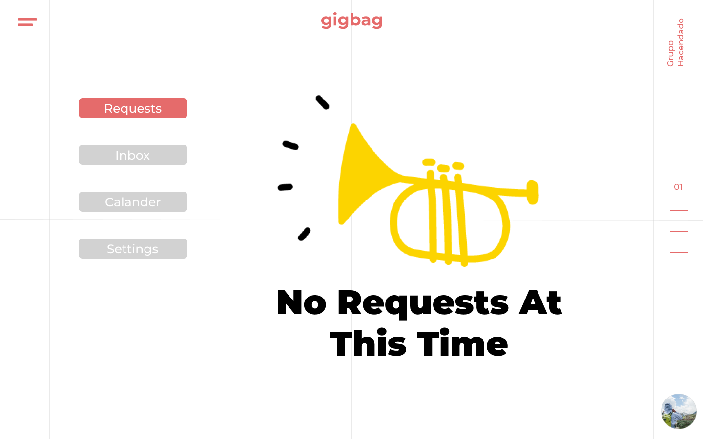  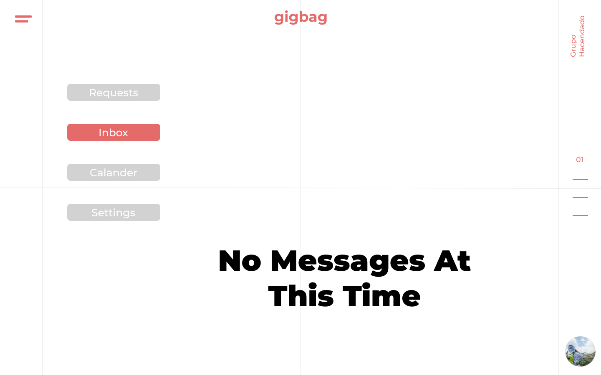 
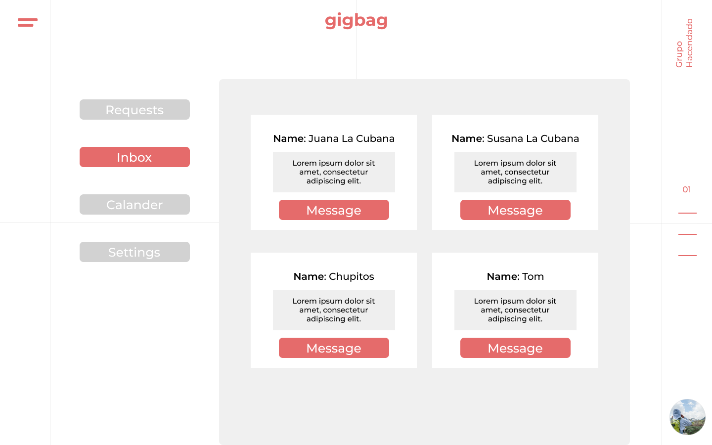   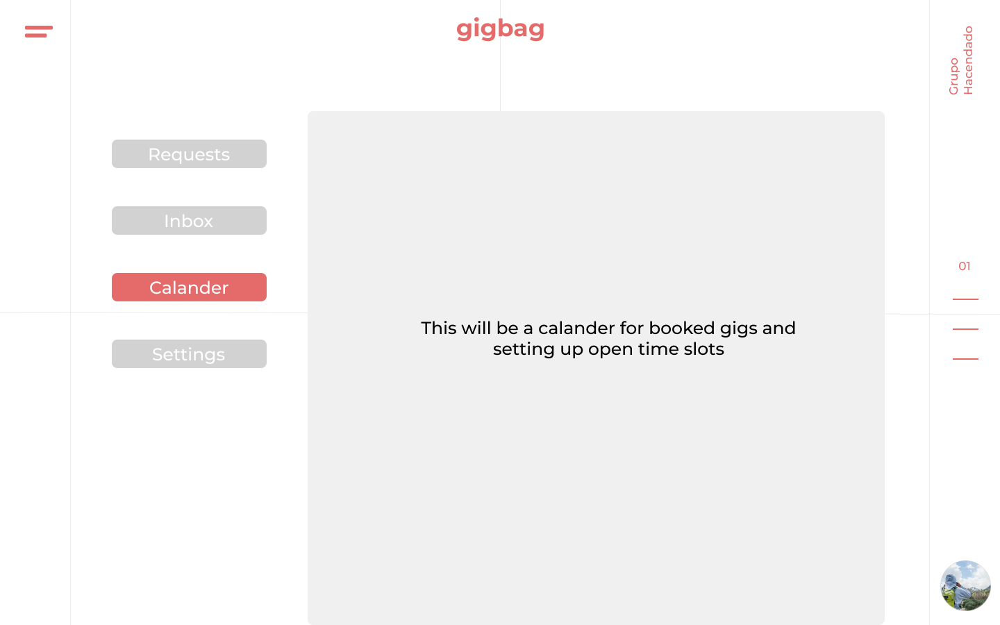 
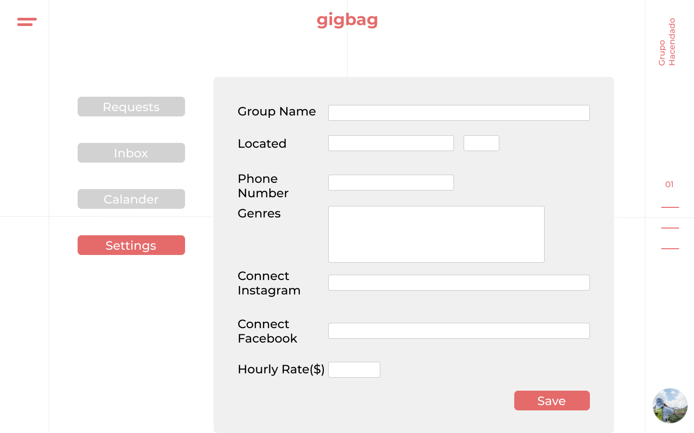 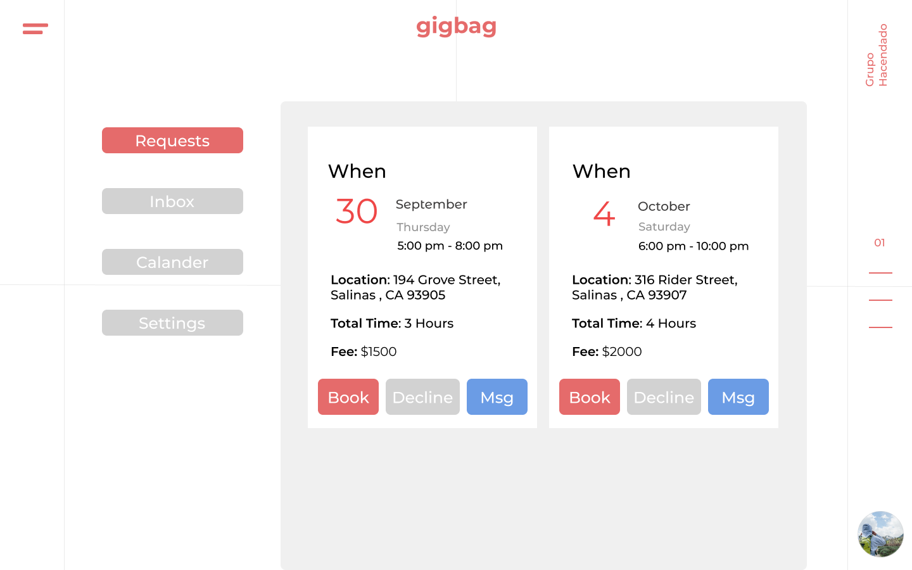 

# Explore Section
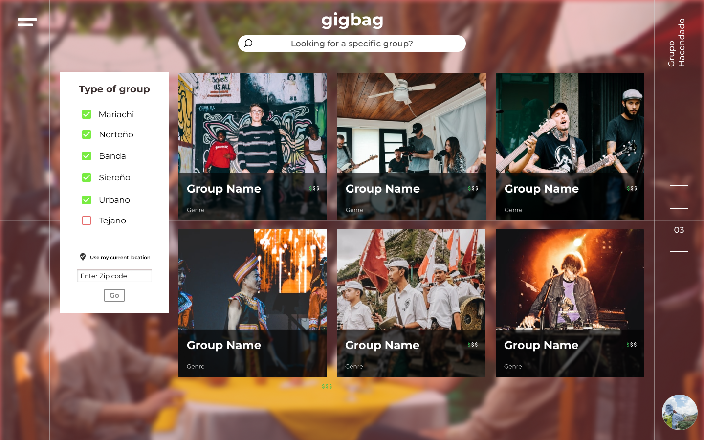  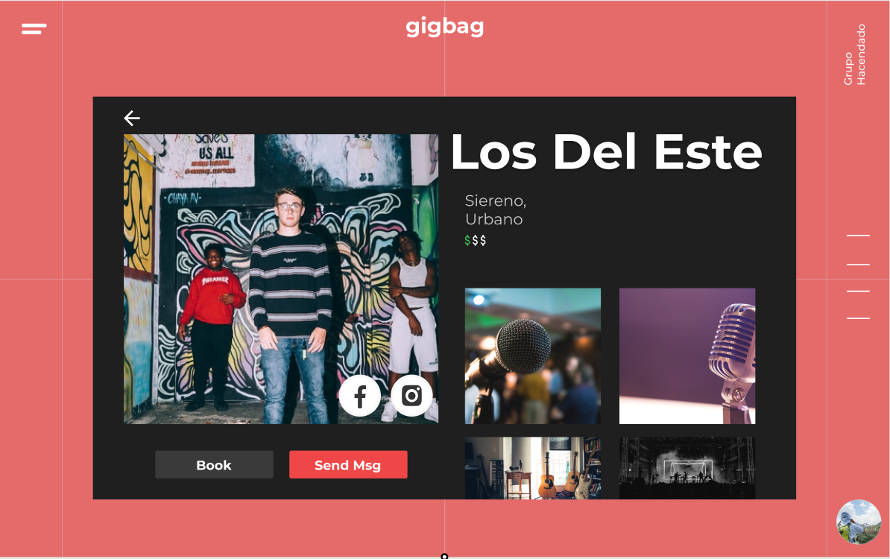 
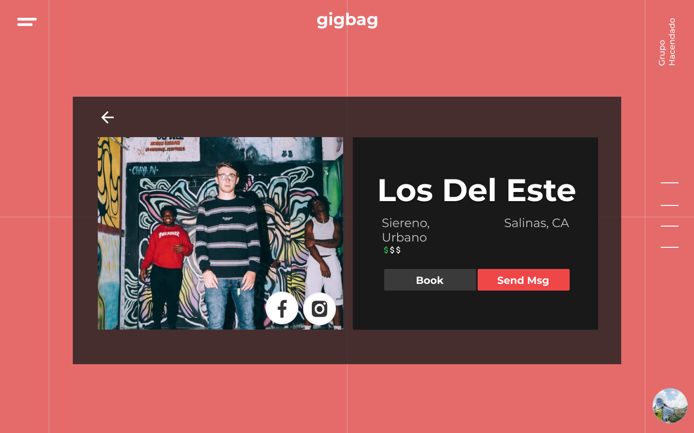   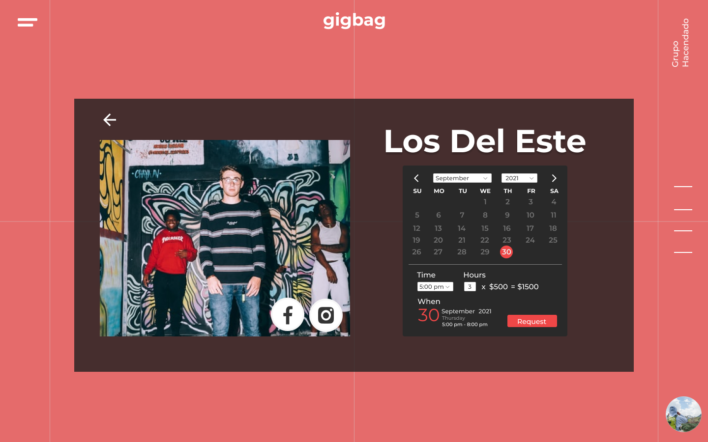 
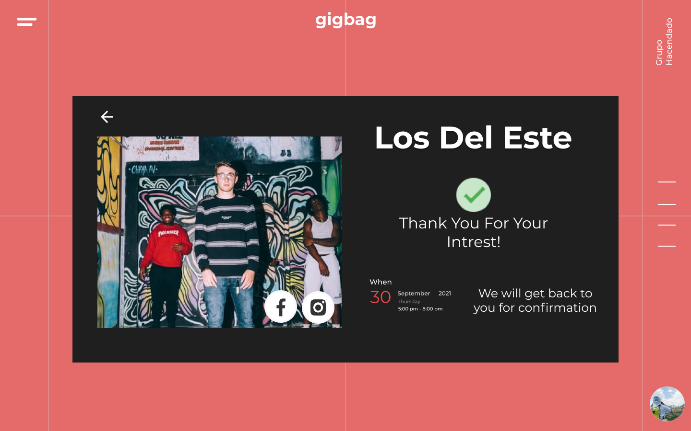 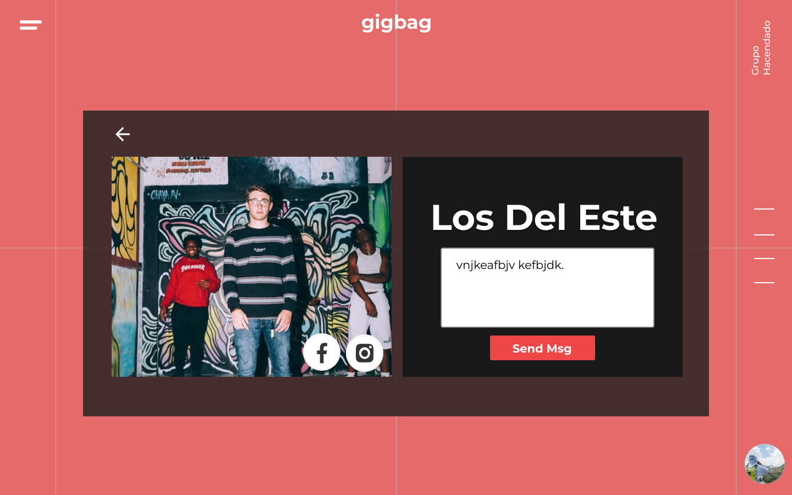
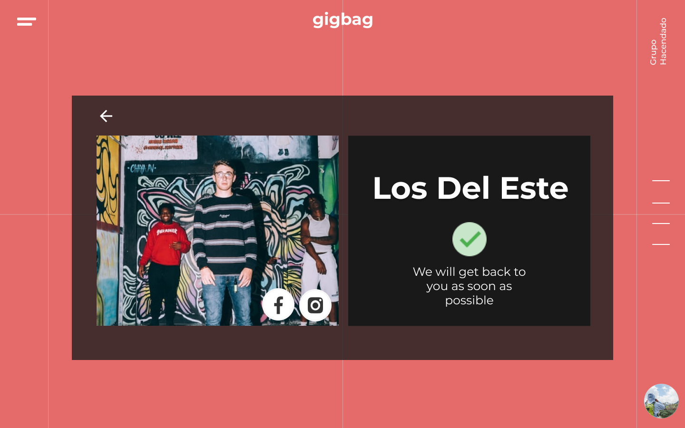

# Sign In/ Sign Up Flow
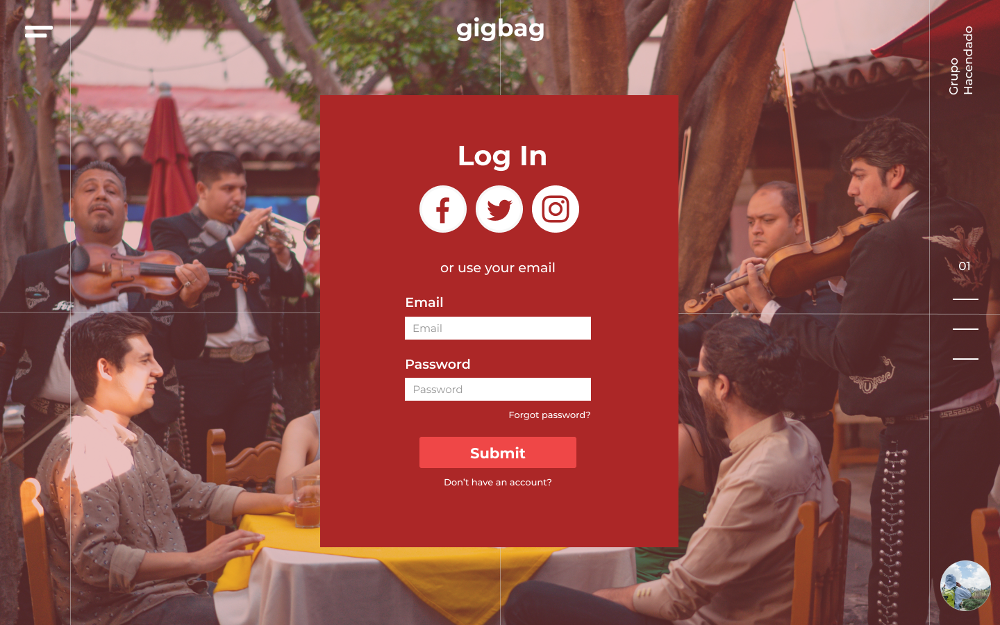  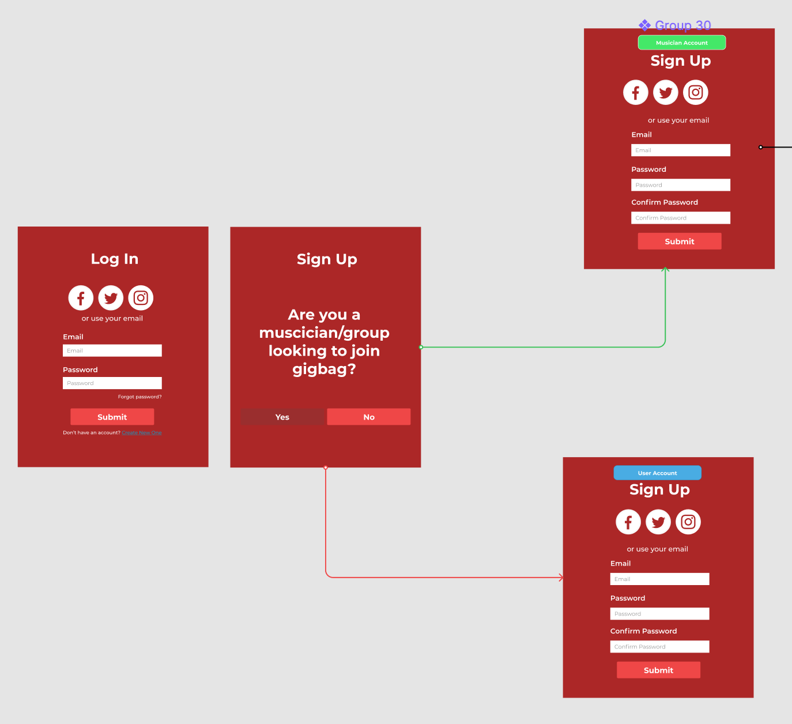 
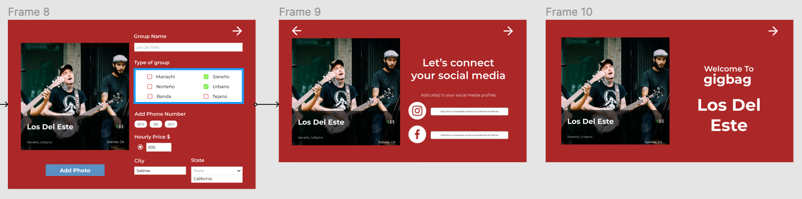  
